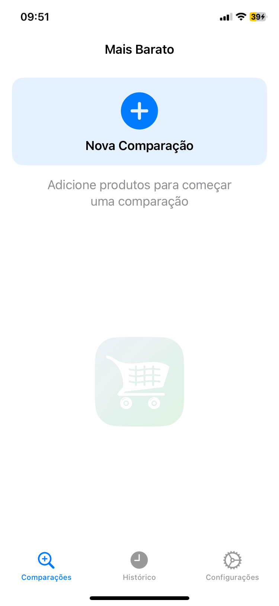
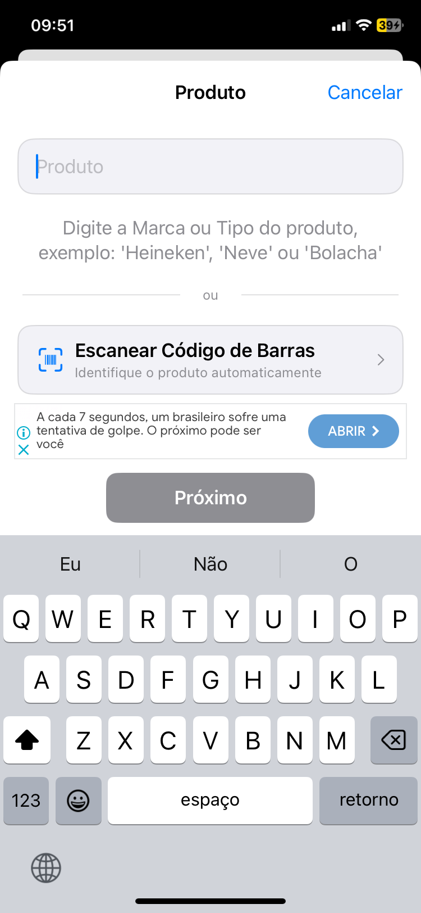
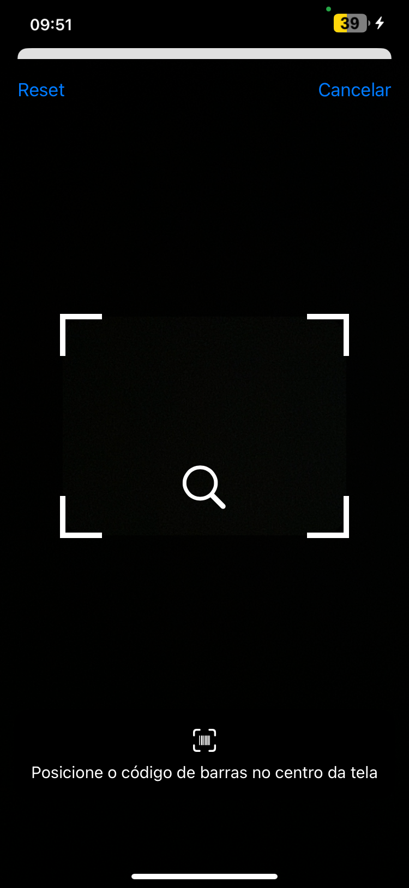
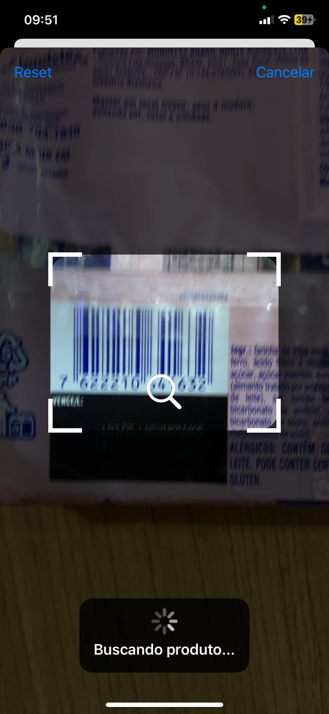
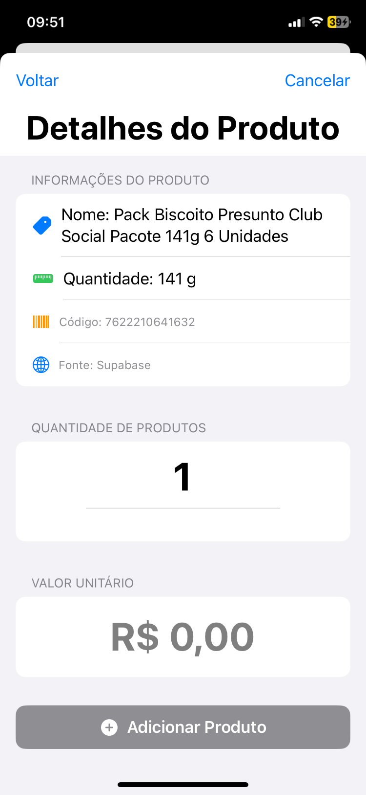
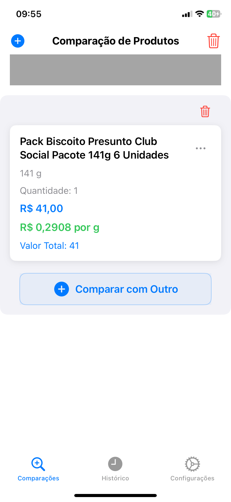
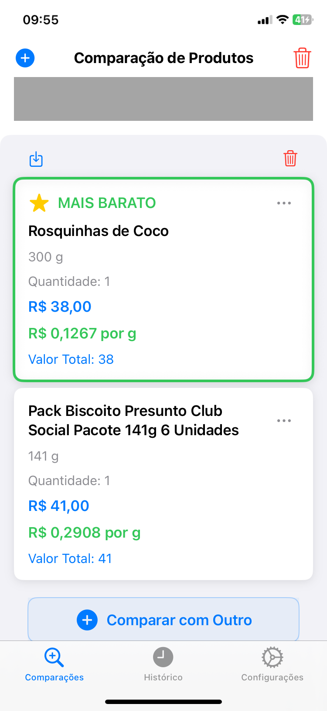
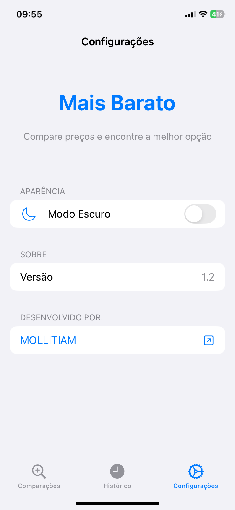
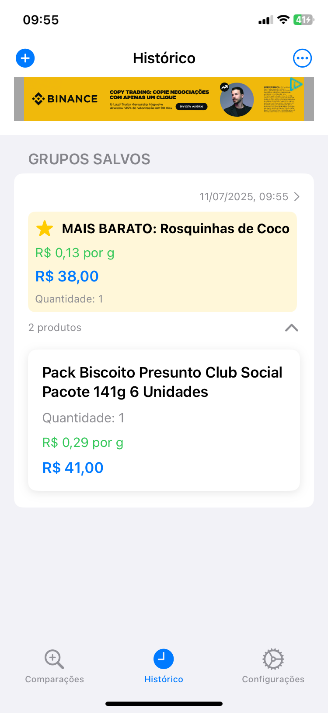

# Mais Barato – Demonstração

🚫 **Este repositório é demonstrativo. O uso, cópia ou redistribuição sem autorização explícita é proibido.**  
© Mollitiam Development.

## Sobre o App

O **Mais Barato** é um aplicativo para comparação de preços de produtos, facilitando a escolha da melhor opção para o consumidor.  
Com ele, é possível adicionar produtos manualmente ou por leitura de código de barras, comparar preços por unidade de medida e salvar históricos de comparação.

## Funcionalidades Principais

- Adição de produtos manualmente ou por código de barras
- Comparação automática de preços por unidade
- Histórico de comparações realizadas
- Interface simples e intuitiva
- Modo escuro e configurações personalizáveis

## Technical Overview

- **Linguagem:** Swift
- **Framework:** SwiftUI
- **Arquitetura:** MVVM
- **Funcionalidades:** Leitura de código de barras, comparação de preços, histórico local, modo escuro
- **Integração:** API REST para consulta de produtos
- **Armazenamento:** Local e sincronização com nuvem (Supabase)

## Funcionamento do Scanner

- Scanner atualizado e otimizado (AVFoundation + SwiftUI)
- Consulta em 7 fontes de dados, com cache via Supabase
- Ordem de busca revisada e mensagem de resultado ajustada
- Fallback simples para adição manual quando não encontrado
- Estrutura de banco (Supabase) preparada para cache e histórico

## Fontes consultadas

1. Supabase (cache)
2. Open Food Facts
3. Open Products Facts
4. Open Pet Food Facts
5. Open Beauty Facts
6. UPCitemdb
7. Barcode Lookup

## 📱 Screenshots

### 1. Tela Inicial

### 2. Escolha do Método de Entrada do Produto

### 3. Leitura do Código de Barras

### 4. Detalhes do Produto

### 5. Comparação de Preços

### 6. Comparação Realizada

### 7. Configurações

### 8. Histórico

---

## Baixe na App Store

---

## Contato

Para mais informações, entre em contato:  
https://mollitiamdevelopment.great-site.net
